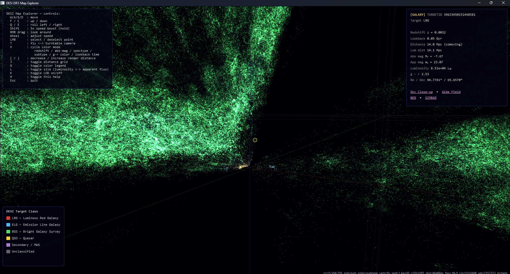

# DESI Map Explorer

A GPU-accelerated 3D fly-through viewer for the [DESI](https://www.desi.lbl.gov/) galaxy redshift survey. Renders up to ~18 million galaxies and quasars in real-time, with point selection, six color modes, and direct links to external catalogs.




## Features

- **Fly-through camera** with WASD + mouse-look, adjustable speed, and shift-boost
- **Point selection** (left-click) with camera lock-on, distance-scaled orbiting, and an info panel showing redshift, distance, luminosity, magnitudes, and lookback time
- **Clickable external links** for each selected object: DESI Spectrum, Legacy Survey sky image, NED, SIMBAD
- **6 color modes** (press V to cycle):
  - **Redshift** (z) - cyan (nearby) to red (distant)
  - **Absolute magnitude** (M_r) - intrinsic brightness
  - **Spectral type** - GALAXY / QSO / other
  - **DESI target class** - LRG / ELG / BGS / QSO / Secondary / Unclassified
  - **Rest-frame g-r** - blue (star-forming) to red (elliptical)
  - **Lookback time** - 0 Gyr (now) to 13 Gyr (ancient)
- **Color legend** (press G) with gradient bars or categorical swatches
- **Two size modes** - absolute luminosity or apparent flux
- **LOD** - automatic level-of-detail for datasets above 5M points
- **Auto-download** - fetches the FITS catalog from DESI servers with resume support

## Quick Start

```bash
# Clone and set up
git clone https://github.com/itsRevela/DESI-DR1-Map-Explorer.git
cd DESI-DR1-Map-Explorer
python -m venv venv
venv\Scripts\activate        # Windows
# source venv/bin/activate   # macOS/Linux

pip install -r requirements.txt

# Run with the EDR dataset (~2 GB download, ~1.2M points)
python main.py --dataset edr

# Run with the full DR1 dataset (~21 GB download, ~18M points)
python main.py --dataset dr1
```

The first run downloads the FITS file and builds a processed cache (`points_v4.npz`). Subsequent runs load the cache in seconds.

## Controls

| Key | Action |
|-----|--------|
| W / A / S / D | Move forward / left / back / right |
| F / C | Move up / down |
| Shift (hold) | 5x speed boost |
| Scroll wheel | Adjust movement speed |
| Right-click drag | Look around (cursor captured) |
| Left-click | Select / deselect nearest point |
| V | Cycle color mode |
| G | Toggle color legend |
| L | Toggle point size (luminosity / flux) |
| K | Toggle LOD on/off |
| T | Swap fly / turntable camera |
| H | Toggle help overlay |
| Esc | Quit |

When a point is selected, the camera locks onto it. WASD orbits around the target with distance-scaled speed. Left-click again to deselect and resume free flight.

## Architecture

```
main.py          Entry point, CLI args, orchestrates pipeline
download.py      HTTP download with range-based resume + tqdm progress
process.py       FITS filtering, Planck18 cosmology, npz caching
viewer.py        Vispy + PyQt6 GPU renderer, camera, selection, UI
```

### Data Pipeline

1. **Download** - fetches the DESI zcatalog FITS file (~2-8 GB) with automatic resume
2. **Process** - filters for reliable extragalactic objects (ZWARN=0, not STAR, 0.001 < z < 4.0), computes Planck18 comoving distances, absolute magnitudes, lookback times, and caches everything to a `.npz` file
3. **View** - uploads positions to the GPU as a point cloud with additive blending for a natural starfield glow

### Selection & Picking

Point selection uses a KD-tree (built in background at startup) with ray-marching: 2000 samples along the view ray query the tree for k=3 nearest neighbors, then the candidate with the smallest angular offset from the ray wins. This scales to 18M+ points with ~1ms pick time.

## Data Sources

- [DESI Early Data Release (EDR)](https://data.desi.lbl.gov/public/edr/) - ~1.2M objects after filtering
- [DESI Data Release 1 (DR1)](https://data.desi.lbl.gov/public/dr1/) - ~18M objects after filtering
- Cosmology: [Planck 2018](https://docs.astropy.org/en/stable/cosmology/index.html) via astropy

## Requirements

- Python 3.14+
- GPU with OpenGL support (integrated graphics works for EDR; dedicated GPU recommended for DR1)
- ~500 MB RAM for EDR, ~4 GB for DR1
- See `requirements.txt` for Python packages

## License

This project uses publicly available DESI survey data. See the [DESI data policy](https://data.desi.lbl.gov/doc/policy/) for data usage terms.
